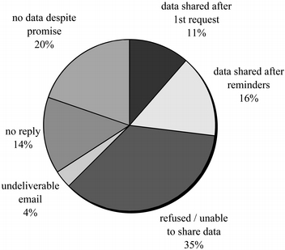
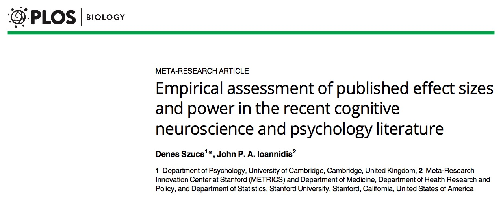
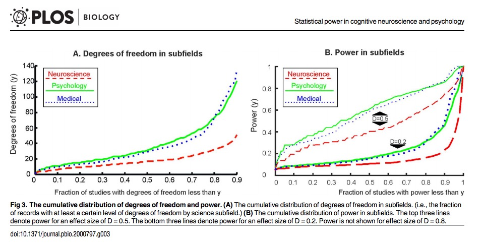
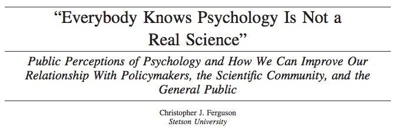

```{r setup, include=FALSE}
knitr::opts_chunk$set(echo = FALSE)
```

---

<div class="centered">


</br>

</br>

</div>

## Agenda

- Imagine...
- Barriers and blinders
- Let's get real
- Open! Says me

## Imagine

## ...meta-analyses from your desktop

---

<div class="centered">
<video width="800" controls>
  <source src="mov/neurosynth-happy.mp4" type="video/mp4">
Your browser does not support the video tag.
</video>
</div>

## ...visualization of task data accumulated across studies & labs

---

<div class="centered">
<video width="800" controls>
  <source src="mov/wordbank-vocabulary.mp4" type="video/mp4">
Your browser does not support the video tag.
</video>
</div>

## ...machine-learning assisted audio & video analysis

---

<div class="centered">
<video height="550" controls>
  <source src="mov/Construction.mp4" type="video/mp4">
Your browser does not support the video tag.
</video>
</div>

*Source*: Ori Ossmy (NYU)

## ..."scriptable" analysis and visualizations from shared data

---

<div class="centered">
<video width="800" controls>
  <source src="mov/summarize_demog.mp4" type="video/mp4">
</video></div>

## ...easy downloading and reuse of others' materials

<div class="centered">
<audio controls>
  <source src="https://nyu.databrary.org/slot/12213/0,15046/asset/46757/download?inline=true" type="audio/mpeg">
Your browser does not support the audio element.
</audio>
<audio controls>
  <source src="https://nyu.databrary.org/slot/12212/0,15046/asset/46748/download?inline=true" type="audio/mpeg">
Your browser does not support the audio element.
</audio>
</br>
</br>
Cole, P.M., Gilmore, R.O., Scherf, K.S. & Perez-Edgar, K. (2016). The Proximal Emotional Environment Project (PEEP). Databrary. http://doi.org/10.17910/B7.248.
</div>

## ...reproduction of others' procedures through video protocols

---

<div class="centered">
<video width="800" controls>
  <source src="https://nyu.databrary.org/slot/14765/0,79273/asset/64898/download?inline=true" type="video/mp4">
Your browser does not support the video tag.
</video>

The PLAY Project Wiki: <https://dev1.ed-projects.nyu.edu/wikis/docuwiki/doku.php/landing>
</div>

## ...A cumulative psychological science

<div class="centered">
<a href="https://www.psychologicalscience.org/observer/becoming-a-cumulative-science">

</a>
</div>

## Where

- Findings accumulate
- Theories are advanced, accepted, expanded, or rejected
- Phenomena become increasingly predictable
- Discovery accelerates

# Barriers

---

<div class="centered">

</div>

---

<div class="centered">

</div>

---

<div class="centered">

</div>

## The tootbrush problem

> "*...psychologists tend to treat other peoples’ theories like toothbrushes; no self-respecting individual wants to use anyone else’s.*"

> "*The toothbrush culture undermines the building of a genuinely cumulative science, encouraging more parallel play and solo game playing, rather than building on each other’s directly relevant best work.*"

-- Mischel, 2009

---

<div class="centered">

</div>

---

<div class="centered">

</div>

---

<div class="centered">

</div>

---

<div class="centered">

</div>

# Solutions

---

### "Common tools" (Mischel 2009)

### "Robust, replicable, consequential findings" (Mischel 2009)

### "Boundary crossing and bridge building" (Mischel 2009)

### Open data and materials sharing (Gilmore + a whole lotta people)

# Get real (practical solutions)

## Plan for sharing

## What

- Data
    - and analysis code (R, Python, SPSS, SAS, ...)
- Protocols & procedures
    - Video as gold standard
- Displays (& code to generate)

## Where

- Data repository
    - ICPSR, Dataverse, OSF, Dryad, 
    - Databrary, OpenNeuro, TalkBank, WordBank
- Institutional repository
- Data paper (e.g. *Nature Scientific Data*)
- Supplemental material with article

## With whom

- Public
    - Risk of reidentification
    - Can you anonymize?
- Researchers
    - ICPSR & Databrary
- People you select & vet

## When 

- Soon after you collect it
- On manuscript submission
- On acceptance or publication
- End of grant
- ~~When I'm damn good and ready...~~

## How

- "FAIRly": **F**indable, **A**ccesible, **I**nteroperable, and **R**eusable (Wilkinson et al., 2016)

## Ethical data sharing

- Ask permission to share (especially sensitive, identifiable data)
    - Use template language
    - <https://osf.io/9d5hr/>
- Don't promise to destroy data
- Don't restrict future reuses
- Sharing data maximizes benefits of research participation (Brakewood & Poldack, 2013)

# Open! Says me

## Let's build a cumulative, robust, open psychological science

---

<div class="centered">
<video width="800" loop autoplay>
  <source src="mov/databrary-splash.mp4" type="video/mp4">
</video></div>

---

### [databrary.org](https://databrary.org), @databrary

### [datavyu.org](https://datavyu.org), @datavyu

### rogilmore@psu.edu

### [gilmore-lab.github.io](http://gilmore-lab.github.io)

### <https://github.com/gilmore-lab/2018-05-26-aps-opensaysme/>

---

This talk was produced on `r Sys.time()` in [RStudio 1.1.383](http://rstudio.com) using R Markdown and the reveal.JS framework.
The code and materials used to generate the slides may be found at <https://github.com/gilmore-lab/2018-05-26-aps-opensaysme/>. 
Information about the R Session that produced the slides is as follows:

---

```{r session-info}
sessionInfo()
```
